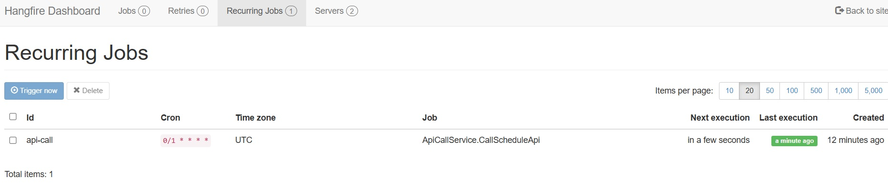
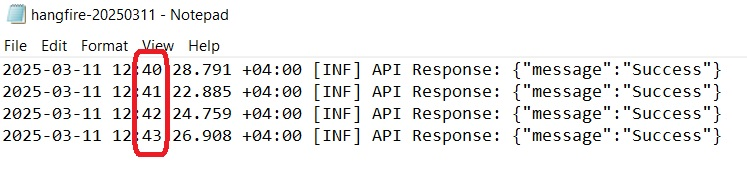

# Hangfire Schedule Job Sample

## Overview
This is a **Hangfire** application that calls an API on a scheduled basis using a cron expression every minute. Hangfire is a better approach than a Windows service for similar tasks. It can also be used for executing background jobs. With Hangfire, you can monitor the scheduled job status.

## Features
**Cron-based Scheduling for precise job execution timing**

**Recurring Jobs for automated, repeated task execution**

**Dashboard for real-time monitoring of job status and progress**

**Job Prioritization for managing the execution order of tasks**

## Tech Stack
**.NET 8**

**Hangfire.AspNetCore**

**Hangfire.LiteDB**

**Serilog**

## Screenshots of the Hangfire execution monitor in the dashboard and logging the API response

## Hangfire dashboard, which can be accessed at: http://localhost:5012/hangfire

## API response is logged in the Serilog file every minute.

